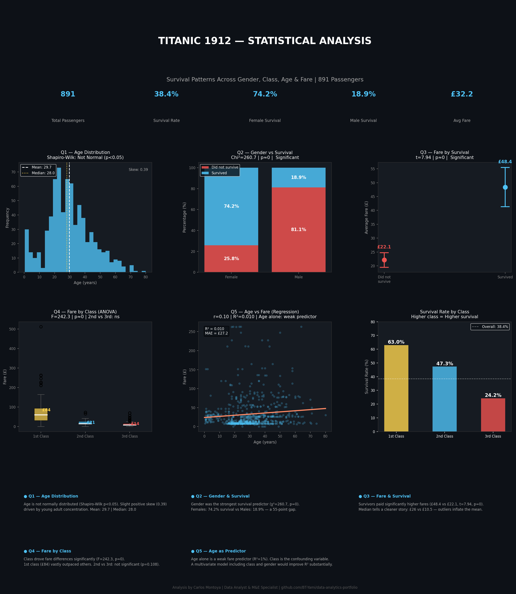

# 📊 Titanic 1912 — Statistical Analysis

## Overview
A complete statistical analysis of the Titanic dataset (891 passengers) 
applying five analytical methods to uncover survival patterns across 
gender, class, age, and fare.

This project demonstrates end-to-end applied statistics — from normality 
testing to regression — with professional visualizations and 
executive-level interpretation.

---

## ❓ Research Questions & Methods

| # | Question | Method | Key Result |
|---|----------|--------|------------|
| 1 | Are age values normally distributed? | Shapiro-Wilk + Q-Q Plot | Not normal (p<0.05), slight positive skew (0.39) |
| 2 | Did gender influence survival? | Chi-square test | Yes — 74.2% female vs 18.9% male (χ²=260.7, p≈0) |
| 3 | Did survivors pay higher fares? | t-test + Confidence Intervals | Yes — £48.4 vs £22.1 (t=7.94, p≈0) |
| 4 | Did fare vary across the 3 classes? | One-way ANOVA + Tukey HSD | Yes — but 2nd vs 3rd class: not significant (p=0.108) |
| 5 | Does age predict fare paid? | Pearson Correlation + Linear Regression | No — R²=1%, class is the confounding variable |

---

## 🔑 Key Findings

- **Gender was the strongest survival predictor** — females survived at 
  nearly 4x the rate of males, directly reflecting the "women and 
  children first" protocol
- **Class determined economic access to survival** — 1st class: 63.0%, 
  2nd class: 47.3%, 3rd class: 24.2%
- **Fare differences were statistically significant** between survivors 
  and non-survivors, but median values (£26 vs £10.5) tell a cleaner 
  story than means — outliers inflate the average
- **2nd and 3rd class fares were not significantly different** (Tukey 
  p=0.108), suggesting both represented a similar economic segment
- **Age alone is a weak fare predictor** (R²=1%) — class is the 
  confounding variable; a multivariate model would substantially 
  improve predictive power

---

## 📁 Files

| File | Description |
|------|-------------|
| `Titanic-Statistical-Project.ipynb` | Full analysis notebook with code and outputs |
| `titanic_statistical_analysis.png` | Executive dashboard — all 5 analyses |

---

## 🛠️ Tools & Methods

**Statistical Methods:**
Shapiro-Wilk · Q-Q Plot · Chi-square · t-test · 
Confidence Intervals · One-way ANOVA · Tukey HSD · 
Pearson Correlation · Linear Regression

---

## 📊 Executive Dashboard

---

## 💡 What I Would Do Next

- Apply **multivariate regression** including class, gender, and age 
  simultaneously — expected R² improvement from 1% to 40%+
- Build a **logistic regression model** to predict survival probability
- Explore **interaction effects** between gender and class on survival

---

*Analysis by Carlos Montoya | Data Analyst & M&E Specialist*  
*[Portfolio](https://astonishing-rat-e35.notion.site) · 
[GitHub](https://github.com/BT-Yami/data-analytics-portfolio) · 
[LinkedIn](www.linkedin.com/in/carlos-montoya-urquía-b462351ba)
